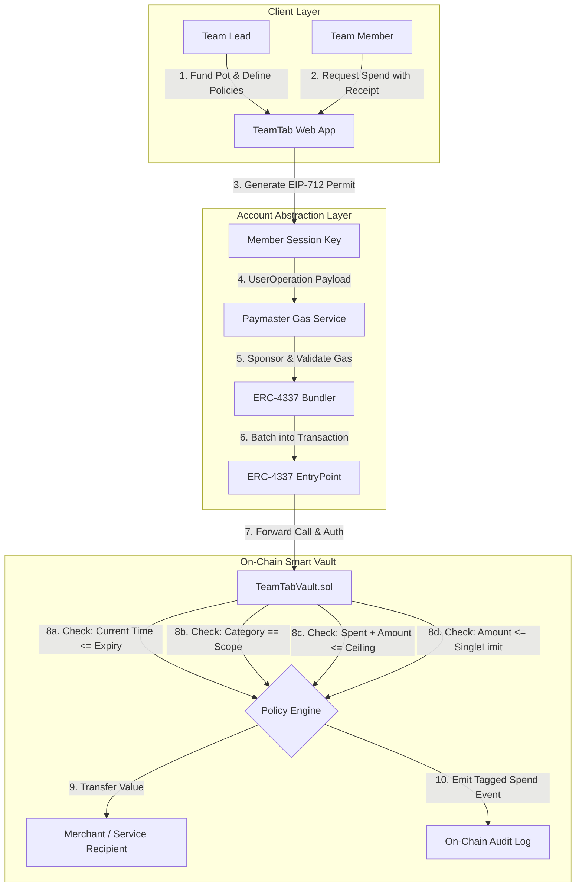

# TeamTab Architecture & Technical Design Document

**ROAD TO DEVCON – IIITN EDITION**  
*Ethereum Research Workshop & Builders Lab | IIIT Nagpur × Bhaisaaab*

---

## 1. System Architecture Overview

TeamTab provides **programmable, trustless team expense delegation**. Instead of relying on a human team lead to hold the credit card or personally sign every transaction, TeamTab leverages **ERC-4337 Account Abstraction** and **Cryptographic Session Keys** to decentralize spending authority with strict boundary controls.



---

## 2. Layer-by-Layer Architectural Breakdown

### 2.1 The User & Frontend Layer (`/src`)
- **Technology:** Next.js 14 App Router, React 18, Tailwind CSS, Viem / Wagmi.
- **Why it exists:** Hides blockchain infrastructure complexity. Teammates interact with a clean expense dashboard (choose merchant, enter memo, attach invoice), while the frontend converts user intent into a cryptographically signed `UserOperation` under the hood.
- **Persona Context Engine:** Allows instant switching between Team Lead view (budget allocation, key management, pot sweeping) and Member views (real-time remaining allowance, quick vendor presets, gasless execution).

### 2.2 The Session Key Layer (`ScopedKey` & EIP-712 Signers)
- **Why it exists:** In standard Ethereum, an EOA private key grants unbounded access to 100% of the funds forever. Session Keys introduce **programmable constraint boundaries**:
  - `ceiling`: Maximum lifetime spending budget.
  - `singleTxLimit`: Defense against wallet draining.
  - `category`: Whitelisted expense domain (e.g. *API Credits*, *Hardware*, *Food*).
  - `expiry`: Exact timestamp after which the key becomes cryptographically invalid on-chain.
- **EIP-712 Typed Signing:** Signatures follow the `SpendAuthorization` structured hash:
  ```solidity
  bytes32 public constant SPEND_TYPEHASH = keccak256(
      "SpendAuthorization(address member,address recipient,uint256 amount,string category,string purpose,string receiptHash,uint256 nonce,uint256 deadline)"
  );
  ```

### 2.3 ERC-4337 Infrastructure (Paymaster & Bundler)
- **Paymaster (Gas Sponsorship):** Teammates should not need testnet ETH in their personal wallets just to pay for an API key or hackathon pizza. The Paymaster checks that the UserOp matches the TeamTab vault rules and sponsors 100% of the gas cost.
- **Bundler & EntryPoint:** Aggregates member spending UserOperations into standard Ethereum transactions and submits them to the canonical EntryPoint contract.

### 2.4 The On-Chain Smart Vault Layer (`contracts/TeamTabVault.sol`)
- **Core State & Policy Enforcement:**
  1. **Time Check:** `require(block.timestamp <= key.expiry && block.timestamp <= eventEndTime, "KeyExpired")`
  2. **Category Check:** `require(keccak256(bytes(key.category)) == keccak256(bytes(category)), "CategoryMismatch")`
  3. **Single Transaction Limit:** `require(amount <= key.singleTxLimit, "ExceedsSingleTxLimit")`
  4. **Budget Ceiling:** `require(key.spent + amount <= key.ceiling, "ExceedsBudgetCeiling")`
  5. **Vault Liquidity:** `require(address(this).balance >= amount, "InsufficientVaultBalance")`
- **Tagged Spend Logging:** Emits `TaggedSpendExecuted` event anchoring spender, recipient, amount, category, purpose, and IPFS receipt hash to the permanent ledger.
- **Post-Event Sweeping:** The Team Lead can execute `sweepRemainingFunds` to withdraw unspent pot balance once the event concludes.

---

## 3. Security & Threat Modeling

| Threat Vector | Mitigation Strategy in TeamTab |
| :--- | :--- |
| **Rogue Teammate Draining Entire Pot** | Hard enforced `ceiling` and `singleTxLimit` in smart contract storage. |
| **Misappropriation of Funds** | Category whitelist prevents using "API Compute" budget for personal travel. |
| **Unauthorized Post-Event Spending** | On-chain `expiry` timestamp invalidates the session key automatically at deadline. |
| **Signature Replay Attacks** | Unique `nonces` per member and `deadline` parameter in EIP-712 digest. |
| **Lead Abandonment** | Open audit trail enables public verification of all spends and remaining pot balance. |

---

## 4. Why Account Abstraction is Essential for TeamTab

| Without Account Abstraction (Traditional EOA / MultiSig) | With TeamTab (ERC-4337 Smart Accounts) |
| :--- | :--- |
| Lead must manually sign and approve every 50-cent API top-up. | Lead sets parameters once; teammates spend autonomously. |
| Teammates must hold gas tokens (ETH) to execute any tx. | Gas is 100% sponsored by Paymaster ($0 out of pocket). |
| Handing a private key grants unconstrained access to all funds. | Scoped session keys restrict category, ceiling, and time. |
| Post-event reimbursement spreadsheet chaos for weeks. | Instant, transparent on-chain expense audit trail with IPFS receipts. |
