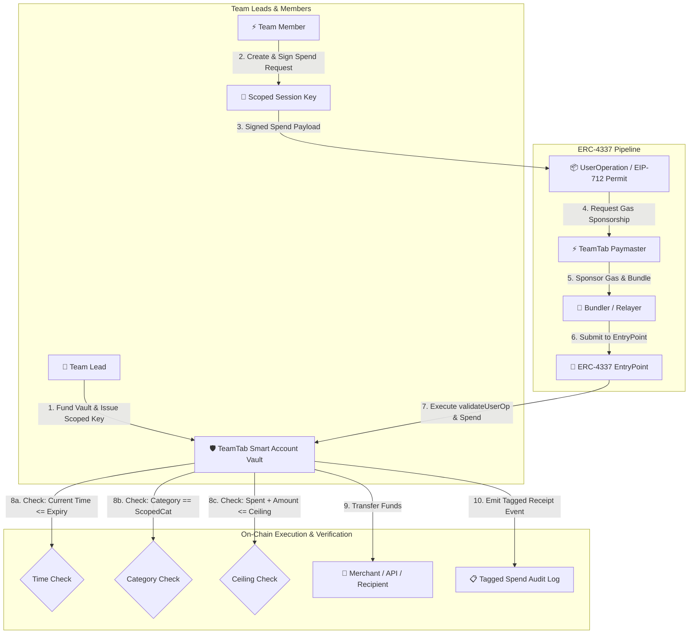

# ROAD TO DEVCON – IIITN EDITION
## TeamTab

### Built At
Ethereum Research Workshop & Builders Lab  
IIIT Nagpur × Bhaisaaab

---

### Project Overview
**TeamTab** is a programmable team spending vault powered by **ERC-4337 Account Abstraction** and **Scoped Session Keys**. It solves the universal hackathon and club friction where team expenses funnel through whoever holds the physical card or crypto wallet, followed by weeks of chasing receipts, manual spreadsheets, and awkward reimbursement follow-ups.

With TeamTab, the team lead funds **one shared Smart Account** and delegates scoped, cryptographic session keys to each team member. Each key is strictly bounded by:
1. **Category Constraint** (e.g. *API Credits & Compute*, *Hardware & Sensors*, *Food & Energy Drinks*)
2. **Budget Ceiling** (maximum lifetime spending allowance)
3. **Single Transaction Cap** (anti-drain safety limit)
4. **Expiration Timestamp** (authority automatically self-destructs when the hackathon judging begins)

Every expenditure is tagged on-chain with purpose memos and IPFS receipt proofs. Teammates spend gaslessly through **Paymaster Gas Sponsorship**, paying $0.00 out of pocket.

---

### The Problem
During hackathons, college club sprints, and builder events:
- **Single Point of Bottleneck:** One person (usually the team lead) holds the funds or credit card. Every single API key purchase, Uber ride, pizza order, or sensor kit requires interrupting the lead.
- **The "Reimbursement Nightmare":** Teammates end up paying out of pocket, losing paper receipts, and spending two weeks post-event submitting expense spreadsheets.
- **Risk of Overspending / Shared Keys:** Sharing an EOA private key or credit card details gives unconstrained access to the entire treasury.
- **Gas Token Barrier:** Requiring every student teammate to have testnet gas tokens (Sepolia ETH) in their personal EOA introduces unnecessary onboarding friction.

---

### The Solution
TeamTab replaces manual trust and credit-card sharing with **programmable, trustless delegation**:
- **One Shared Pot:** Team lead deposits funds once into `TeamTabVault.sol`.
- **Scoped Session Keys:** Lead issues role-tailored ephemeral session keys (e.g. 0.50 ETH for AI Lead, 0.40 ETH for Hardware Lead).
- **Enforced Smart Account Policies:** The Smart Account checks budget ceilings, single tx caps, and category whitelist on every execution.
- **Gasless UserOps:** Paymaster covers gas so teammates spend without needing ETH for gas in their personal EOAs.
- **Real-Time Tagged Audit Trail:** Every transaction records spender name, category, purpose memo, and verifiable receipt hash on-chain.
- **Automatic Expiry & Sweeping:** When the hackathon timer hits zero, all member authority instantly expires, and the lead can sweep unspent pot back in 1 click.

---

### Why Account Abstraction?
Traditional Ethereum EOAs (Externally Owned Accounts) are all-or-nothing: if you give someone your private key, they have 100% control over all your assets forever.

**ERC-4337 Account Abstraction transforms the account into programmable code**, enabling:
- **Granular Session Keys:** Subordinate keys that can only sign transactions matching specific contract criteria (target, amount, category, expiry).
- **Gas Abstraction (Paymaster):** The team vault or sponsor pays transaction gas fees via `Paymaster`, eliminating the need for teammates to fund their personal wallets with gas.
- **Batching & Tagging:** Spends, allowances, and IPFS receipt attestations are executed in a single atomic UserOperation.
- **Auto-Expiring Authority:** Time-locks baked directly into signature verification logic without manual key rotation.

---

### Key Features
* 🔑 **Cryptographic Session Keys:** Issue scoped spending passes with custom ceilings, single tx caps, and categories.
* ⚡ **ERC-4337 Paymaster Gas Sponsorship:** Teammates experience 100% sponsored gas fees ($0 gas paid by spender).
* 🏷️ **Tagged Expense Audit Trail:** Real-time stream of all expenditures with categorized tags and IPFS receipt hashes.
* ⏱️ **Auto-Expiring Time Locks:** On-chain timestamp verification ensures keys expire right when the hackathon ends.
* 🛡️ **Interactive Policy Sandbox:** Live testing terminal to simulate and verify Smart Account policy rejections (`ExceedsBudgetCeiling`, `CategoryMismatch`, `ExceedsSingleTxLimit`, `KeyExpired`).
* 📊 **Exportable Expense Reports:** 1-click CSV export ready for hackathon sponsors and club treasurers.
* 👑 **One-Click Post-Event Sweep:** Team lead recovers all unused pot balance once the event concludes.

---

### ERC-4337 / Smart Account Architecture



---

### User Flow

1. **Step 1: Team Lead Inception**
   - Lead initializes team tab with Team Name, Hackathon Event, and Expiration Date.
   - Lead deposits initial budget (e.g. 2.50 ETH).
2. **Step 2: Scoped Key Delegation**
   - Lead registers teammates with specific budgets (e.g. Alex: 0.50 ETH for `API Credits`, Maya: 0.40 ETH for `Hardware`).
   - Generates 1-click session pass links / QR codes.
3. **Step 3: Gasless Autonomous Spending**
   - Teammate opens Member Spending Terminal, selects merchant, attaches receipt, and executes spend.
   - Paymaster sponsors gas; Smart Vault validates policy and transfers funds to merchant.
4. **Step 4: Real-Time Team Auditing**
   - All teammates see the live spending feed with categorized tags and IPFS receipt proofs.
5. **Step 5: Event Conclusion & Sweep**
   - Hackathon ends; all session keys auto-expire. Lead sweeps remaining unspent funds back to treasury.

---

### Tech Stack

- **Frontend & UI:** Next.js 14 (App Router), React 18, TypeScript, Tailwind CSS, Lucide Icons, Canvas Confetti
- **Web3 & Blockchain:** Viem, Wagmi, Ethers.js
- **Smart Contracts:** Solidity `^0.8.20`, Hardhat, Hardhat Toolbox
- **Account Abstraction Infrastructure:** ERC-4337 UserOperations, Scoped Session Keys, EIP-712 Meta-Transactions, Paymaster Gas Sponsorship
- **Deployment / Network:** Ethereum Sepolia Testnet

---

### Project Structure

```
TeamTab-RoadToDevcon/
├── contracts/
│   ├── TeamTabVault.sol       # Core Smart Account Vault with Scoped Session Key validation
│   └── TeamTabFactory.sol     # Factory for deploying new team tabs
├── test/
│   └── TeamTabVault.test.js   # Comprehensive Hardhat test suite (Policy checks, gasless ops, limits)
├── scripts/
│   └── deploy.js              # Hardhat deployment script for Sepolia
├── src/
│   ├── app/
│   │   ├── globals.css        # Cyber-minimal dark design system & glassmorphism
│   │   ├── layout.tsx         # Root layout with Provider & Toasts
│   │   └── page.tsx           # Primary interactive dashboard
│   ├── components/
│   │   ├── Navbar.tsx         # Persona switcher, Paymaster badge & network status
│   │   ├── VaultStatsCard.tsx # Pot metrics, budget utilization & countdown timer
│   │   ├── MemberKeysManager.tsx # Session keys manager & allowance progress
│   │   ├── SpendTerminal.tsx  # Member spending terminal with real-time AA policy checks
│   │   ├── SpendFeed.tsx      # Live tagged audit trail & CSV expense export
│   │   ├── AAPolicyInspector.tsx # Interactive Account Abstraction Security Sandbox
│   │   ├── IssueKeyModal.tsx  # Modal to register scoped session keys
│   │   ├── FundVaultModal.tsx # Modal to deposit into shared pot
│   │   ├── ReceiptViewerModal.tsx # Modal to inspect verified receipts & IPFS CIDs
│   │   ├── ShareKeyModal.tsx  # Modal to share member pass link & QR
│   │   ├── SweepModal.tsx     # Modal for post-event pot recovery
│   │   └── ToastContainer.tsx # Live feedback notifications
│   └── lib/
│       ├── contracts.ts       # ABIs & Contract configurations
│       ├── mockData.ts        # Hackathon demo presets and categories
│       ├── store.tsx          # React Context & state engine
│       └── types.ts           # TypeScript interfaces
├── hardhat.config.js          # Hardhat configuration
├── package.json
└── README.md
```

---

### Getting Started

#### Prerequisites
- Node.js `>= 18.0.0`
- npm or pnpm

#### Installation

```bash
# 1. Clone the repository
git clone https://github.com/aviraL27/TeamTab-RoadToDevcon.git
cd TeamTab-RoadToDevcon

# 2. Install dependencies
npm install

# 3. Configure environment variables (optional - zero-config demo ready out of the box)
cp .env.example .env.local

# 4. Compile smart contracts
npm run compile

# 5. Run contract test suite
npm run test:contracts

# 6. Start the development server
npm run dev
```

Open [http://localhost:3000](http://localhost:3000) in your browser.

---

### Environment Variables

Create `.env.local` to override defaults (all fields optional):

```env
# Ethereum RPC URL (Default: Sepolia Testnet)
NEXT_PUBLIC_RPC_URL=https://rpc.sepolia.org
NEXT_PUBLIC_CHAIN_ID=11155111

# ERC-4337 Bundler & Paymaster (Pimlico / ZeroDev / Biconomy)
NEXT_PUBLIC_BUNDLER_RPC_URL=https://api.pimlico.io/v2/sepolia/rpc?apikey=YOUR_PIMLICO_API_KEY
NEXT_PUBLIC_PAYMASTER_RPC_URL=https://api.pimlico.io/v2/sepolia/rpc?apikey=YOUR_PIMLICO_API_KEY

# Deployed Smart Contracts
NEXT_PUBLIC_VAULT_FACTORY_ADDRESS=0x38bDF8a12345678901234567890123456789aBCd
NEXT_PUBLIC_DEMO_VAULT_ADDRESS=0x742d35Cc6634C0532925a3b844Bc454e4438f44e
```

---

### Smart Contracts

| Contract | Purpose | Network |
| :--- | :--- | :--- |
| `TeamTabVault.sol` | Core ERC-4337 compatible smart vault enforcing scoped session keys, budget ceilings, category permissions, and gasless execution. | Sepolia Testnet |
| `TeamTabFactory.sol` | Factory enabling any hackathon team lead to spin up a dedicated Team Tab instance. | Sepolia Testnet |

---

### Account Abstraction Features

1. **Scoped Session Keys:** Members hold cryptographic signers restricted strictly to their assigned category and ceiling limit.
2. **Gas Sponsorship (Paymaster):** Network gas is 100% sponsored, eliminating the requirement for teammates to hold testnet ETH.
3. **EIP-712 Meta-Transactions:** Off-chain signature permits submitted seamlessly via bundlers/relayers.
4. **Time-Bounded Self-Destruction:** Session authority auto-expires on-chain at the event deadline.

---

### Demo Flow

1. **Explore Vault & Keys:** Review the active team pot (2.50 ETH), budget utilization bar, and issued session keys for Alex (API Credits), Maya (Hardware), and Jay (Food).
2. **Switch Persona:** Use the top navbar persona selector to switch to **Alex Chen (AI Lead)** or **Maya Patel (Hardware Lead)**.
3. **Execute Gasless Spend:** Navigate to the **Member Spending Terminal**, select a vendor (e.g. *OpenAI API* for 0.12 ETH), and click **Execute Gasless Spend**. Notice the gas breakdown showing $0.00 cost to the member.
4. **Inspect Live Feed:** Switch to **The Live Tab** to see the new expenditure appear instantly with its verified receipt and Sepolia transaction hash.
5. **Test AA Policy Engine:** Open the **AA Policy Sandbox** and trigger intentional policy violations (e.g. over-ceiling spend or unauthorized category) to watch the Smart Account reject the transaction on-chain.

---

### Screenshots

* **Vault Overview & Scoped Keys:** Real-time metrics, budget progress bar, authority countdown timer, and member cards.
* **Member Spending Terminal:** Clean spender interface with vendor presets and gas sponsorship breakdown.
* **Live Spending Tab:** Categorized audit trail with verified receipt attachments and CSV export.
* **AA Policy Sandbox:** Interactive security validator demonstrating ERC-4337 rule enforcement.

---

### Future Improvements

* **Multi-Token Vaults:** Support native spending in USDC, USDT, and DAI with automatic Uniswap v4 routing.
* **Hardware NFC / Physical Pass Integration:** Tap-to-spend cards using burner private keys loaded into physical NFC wristbands at hackathons.
* **ZKP Category Privacy:** Zero-Knowledge Proofs for spend amounts and item details to prevent revealing strategic hackathon project details before presentation.
* **Multi-Lead Threshold Recovery:** Require 2-of-3 leads to adjust global team vault parameters or emergency freeze.

---

### Security Considerations

* **Smart Account Guardrails:** The vault contract enforces strict bounds: `spent + amount <= ceiling` and `amount <= singleTxLimit`.
* **Replay Protection:** EIP-712 nonces and deadline verification prevent signature replay attacks.
* **Owner Isolation:** Only the registered team lead can issue new keys, update ceilings, or sweep remaining balances.

---

### Privacy Considerations

* Account Abstraction manages programmable execution and authorization; public blockchain transactions remain transparent.
* Receipt hashes are anchored via IPFS CIDs. For production enterprise teams, confidential compute or private state trees (such as Aztec or ZK Rollups) would be utilized for sensitive merchant invoices.

---

### Built During

**ROAD TO DEVCON – IIITN EDITION**  
Ethereum Research Workshop & Builders Lab  
IIIT Nagpur × Bhaisaaab